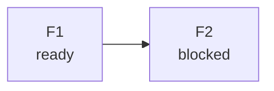

# <outcome> · base `<sha>` · cập nhật <YYYY-MM-DD HH:mm>

Outcome & evidence: <kết quả quan sát được> — <lệnh/đo chứng minh>

| ID | Result | Disposition/write | Owned scope | Boundary | Test seam | Done evidence | State |
|---|---|---|---|---|---|---|---|
| F1 | … | Engineer / write | `path` | C? — ruling ở đâu | `hàm(...)` | lệnh | ready |

**Chẻ:** F1 — "không dấu hiệu" | "<dấu hiệu> → chẻ thành F1a, F1b" | "<dấu hiệu> — không chẻ, ruling ở `<sha>`".
**Now:** … · **Next:** … · **Chờ người yêu cầu quyết:** …

## Dependency · đường đi · lý do
<câu quan hệ có nguyên nhân; phương án + trade-off; nhân–quả cho thứ tự gây ngạc nhiên>

## Risk & trigger replan
<risk mở, item gộp, biện pháp tạm; evidence nào đổi thứ tự>
